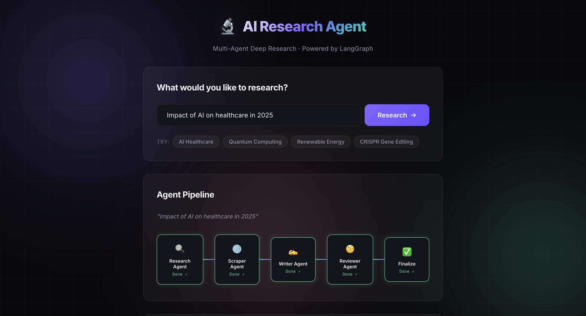

# 🔬 Multi-Agent AI Research System

An autonomous, full-stack research pipeline that generates comprehensive, citation-backed research reports from a single query. Built with a multi-agent architecture using LangGraph for orchestration, Groq & Gemini for LLM inference, and a real-time streaming web interface.


<p align="center">
  
</p>

---

## ✨ Features

- **Multi-Agent Pipeline** — Four specialized AI agents (Research, Scraper, Writer, Reviewer) collaborate autonomously
- **Self-Correcting Reports** — Reviewer agent scores the draft and triggers revision loops until quality is approved
- **Real-Time Streaming UI** — Watch agents work live via Server-Sent Events (SSE)
- **Dual LLM Strategy** — Groq (Llama 3.3 70B) as primary, Google Gemini as automatic fallback
- **LLM Response Caching** — SQLite-backed cache eliminates redundant API calls across runs
- **Smart Scraping** — Dual HTTP fallback (requests → httpx), noise removal, and content extraction
- **Domain Filtering** — Automatically excludes low-quality sources (social media, forums)
- **Dockerized** — One-command deployment with `docker-compose up`

---

## 🏗️ Architecture

```text
                    ┌─────────────────────────────────────────┐
                    │              FastAPI Server              │
                    │         POST /api/research               │
                    │         GET  /api/research/:id/stream    │
                    └────────────────┬────────────────────────┘
                                     │
                    ┌────────────────▼────────────────────────┐
                    │           LangGraph Pipeline             │
                    │                                          │
                    │  Research ──▶ Scrape ──▶ Write ──▶ Review│
                    │                          ▲          │    │
                    │                          │          │    │
                    │                          └──────────┘    │
                    │                       (revision loop)    │
                    │                              │           │
                    │                         Finalize ──▶ Done│
                    └──────────────────────────────────────────┘
```

### Agent Breakdown

| Agent | Role | File |
|-------|------|------|
| 🔍 **Research Agent** | Generates optimized search queries via LLM, searches Tavily, deduplicates & ranks results | `agents/research_agent.py` |
| 🌐 **Scraper Agent** | Fetches web pages, extracts main content with BeautifulSoup, filters noise | `agents/scraper_agent.py` |
| ✍️ **Writer Agent** | Produces structured markdown reports with citations from scraped material | `agents/writer_agent.py` |
| 🧐 **Reviewer Agent** | Scores the report (1–10), returns JSON verdict (APPROVED / NEEDS_REVISION) | `agents/reviewer_agent.py` |

---

## 📁 Project Structure

```text
├── api.py                  # FastAPI server with REST + SSE endpoints
├── main.py                 # CLI entry point
├── config.py               # Central configuration
├── state.py                # Pydantic schemas & TypedDict state
├── agents/
│   ├── research_agent.py   # Search query generation & Tavily search
│   ├── scraper_agent.py    # Web scraping orchestration
│   ├── writer_agent.py     # Report drafting
│   └── reviewer_agent.py   # Quality review & revision gating
├── graph/
│   └── research_graph.py   # LangGraph state machine definition
├── tools/
│   ├── search_tool.py      # Tavily API wrapper
│   └── scraper_tool.py     # HTTP fetching & HTML parsing
├── prompts/
│   ├── research_prompts.py # Search query generation prompt
│   ├── writer_prompts.py   # Report writing prompt
│   └── reviewer_prompts.py # Review & scoring prompt
├── utils/
│   └── helpers.py          # LLM invocation, retries, text utils
├── frontend/
│   ├── index.html          # Web UI
│   ├── style.css           # Dark-mode glassmorphism design
│   └── app.js              # SSE streaming & pipeline visualization
├── Dockerfile
├── docker-compose.yml
└── requirements.txt
```

---

## 🛠️ Tech Stack

| Layer | Technology |
|-------|-----------|
| **Orchestration** | LangGraph (state machine with conditional edges) |
| **LLM Framework** | LangChain |
| **Primary LLM** | Groq — `llama-3.3-70b-versatile` |
| **Fallback LLM** | Google Gemini — `gemini-1.5-flash` |
| **Search API** | Tavily (advanced depth) |
| **Web Scraping** | requests, httpx, BeautifulSoup4, lxml |
| **API Server** | FastAPI + Uvicorn |
| **Frontend** | Vanilla HTML/CSS/JS with SSE |
| **Caching** | LangChain SQLiteCache |
| **Schemas** | Pydantic v2, TypedDict |
| **Containerization** | Docker + Docker Compose |

---

## 🚀 Quick Start

### Prerequisites

- Python 3.10+
- API keys: [Groq](https://console.groq.com/) (required), [Tavily](https://tavily.com/) (required), [Google AI](https://aistudio.google.com/) (optional fallback)

### Local Setup

```bash
# Clone and enter the project
git clone https://github.com/your-username/multi-agent-AI-Research-System.git
cd multi-agent-AI-Research-System

# Create a virtual environment
python3 -m venv .venv
source .venv/bin/activate

# Install dependencies
pip install -r requirements.txt

# Configure API keys
cp .env.example .env
# Edit .env with your keys
```

### Run the Web UI

```bash
uvicorn api:app --reload
```

Open [http://localhost:8000](http://localhost:8000) in your browser.

### Run via CLI

```bash
python main.py "Impact of AI on healthcare in 2025"
```

The report will be printed to the terminal and saved as a `.md` file automatically.

### Run with Docker

```bash
docker-compose up --build
```

Open [http://localhost:8000](http://localhost:8000).

---

## ⚙️ Configuration

All settings are centralized in `config.py`:

```python
PRIMARY_MODEL        = "llama-3.3-70b-versatile"
FALLBACK_MODEL       = "gemini-1.5-flash"
TEMPERATURE          = 0.1
MAX_TOKENS           = 4000
SCRAPE_TIMEOUT       = 10      # seconds
MAX_CONTENT_LEN      = 3000    # tokens per source
MAX_URLS             = 5       # sources to scrape
MAX_REVISIONS        = 2       # reviewer loop limit
```

---

## 📡 API Endpoints

| Method | Endpoint | Description |
|--------|----------|-------------|
| `POST` | `/api/research` | Start a new research job (returns `job_id`) |
| `GET` | `/api/research/{job_id}` | Poll job status, events, and final report |
| `GET` | `/api/research/{job_id}/stream` | SSE stream of real-time agent progress |
| `GET` | `/api/jobs` | List all research jobs |

### Example Request

```bash
curl -X POST http://localhost:8000/api/research \
  -H "Content-Type: application/json" \
  -d '{"query": "Impact of AI on healthcare in 2025"}'
```

---

## 🧪 Development

```bash
# Compile-check all source files
python -m compileall agents graph prompts tools utils config.py state.py main.py api.py

# Smoke test the graph
python -c "from graph.research_graph import build_graph; build_graph(); print('graph ok')"
```

---

## 📝 Notes

- A single failed URL will not crash the pipeline
- Scraping includes a small delay between requests to reduce blocking risk
- Network, search, and LLM calls use error handling and retry logic with exponential backoff
- Reports are saved to disk as `.md` files and served via the web UI
- LLM responses are cached in `.langchain.db` for faster repeat runs

---

## 📄 License

This project is open source and available under the [MIT License](LICENSE).
